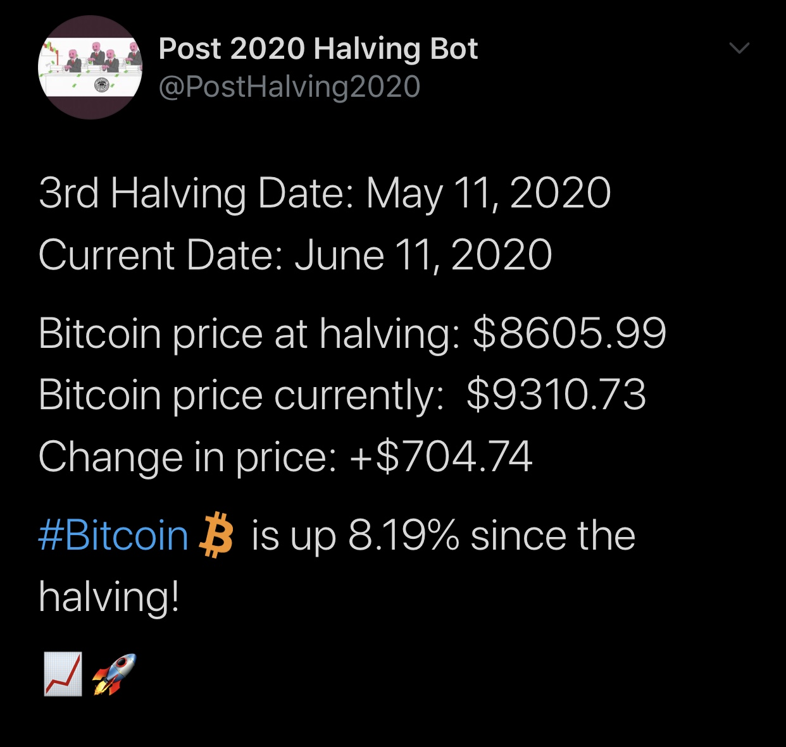

# Bitcoin Halving Twitter Bot

This tweeting bot tweets the price of bitcoin compared to it's price right before the 3rd halving
on May 11th, 2020.

This bot uses the CoinMarketCap (CMC) API to retrieve the current BTC price.

This bot gains it's functionality due to the Twitter API, which can be done by applying for a twitter developers account

Bot automation was done using the free cloud service Heroku. Heroku was also used to help secure my API keys by using there
hide config var feature.

The twitter bot tweets once a day, typically at 8pm central time. (**This is subject to change**)

Tweet Example:

## Important Note

APIs (Application Programming Interfaces) are a structured way for programs to communicate with other programs. A knowledge of APIs allows your programs to communicate with major services such as The New York Times and Twitter and collect data from organizations such as the Library of Congress. 

Do not share your API key, secret, or access tokens with anyone, and do not publish code with your key or token visible. Treat your keys and tokens as you would a password.

## About

I've always had a passion for the bitcoin and blockchain space. I find it really fascinating and I figured why not use my coding skills to create something to help the crypto community on twitter. I certainly believe this brings high value to the people and it serves as a daily reminder that bitcoin is still not dead :).

Notable Followers as of June 17th:

Michael Goldstein (https://twitter.com/bitstein) - Co-host of Noded Podcast, President of Nakamoto Institute, and Crypto Twitter OG.

Creator: Mohammed Patel
--

2nd Year Computer Science & Software Engineering Student at Loyola University Chicago

Lead Website Developer for Blockchain@LUC

